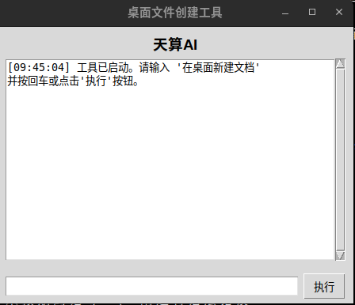
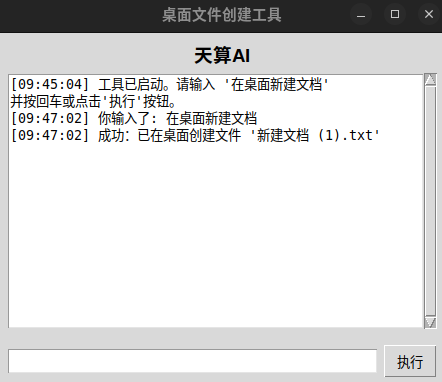

# 桌面文件创建助手 (Ubuntu) / Desktop Creator Tool (Ubuntu)

一个简单的图形界面小工具，可以通过输入命令在 Ubuntu 桌面上快速创建空的文本文档。带有 "天算AI" Logo。

A simple GUI tool to quickly create empty text documents on the Ubuntu desktop via commands. Features the "天算AI" Logo.

## ✨ 功能 (Features)

*   通过图形界面输入框接收命令。
*   识别命令 `在桌面新建文档`。
*   在用户桌面上创建名为 `新建文档.txt` 的空文件。
*   如果文件已存在，则自动创建带编号的版本 (例如 `新建文档 (1).txt`, `新建文档 (2).txt` 等)。
*   界面顶部显示 "天算AI" Logo。

## 📸 截图 (Screenshot)

以下是程序运行时的截图：





*(截图展示了应用的主界面和基本操作效果)*

## 🚀 运行要求 (Requirements)

### 运行源代码 (Running from Source)

*   **操作系统:** Ubuntu 24.04 LTS (已测试), 其他兼容的 Linux 发行版可能也支持。
*   **Python:** Python 3.12 或更高版本。
*   **Tkinter:** Python 的 Tkinter 图形库。
    *   通常需要单独安装，例如在 Ubuntu 上运行:
        ```bash
        # 根据你的 Python 版本选择，如果系统默认是 3.12，通常用下面这个
        sudo apt update
        sudo apt install python3-tk
        # 如果你是通过 PPA 安装了特定版本，如 3.12，可能需要:
        # sudo apt install python3.12-tk
        ```
*   **PySocks (可选):** **仅当**你的系统设置了需要验证的 SOCKS 代理时，才需要安装此库。
    ```bash
    # 在虚拟环境中安装: pip install PySocks
    # 或者系统级安装 (如果不用虚拟环境): sudo apt install python3-socks
    ```

### 运行打包版本 (Running the Packaged Version)

*   兼容的 Linux x86_64 操作系统 (与打包环境一致，例如 Ubuntu 24.04 x86_64)。
*   不需要单独安装 Python 或其他库 (除了系统底层的库)。

## 💡 如何使用 (Usage)

### 从源代码运行 (From Source)

1.  克隆本仓库代码:
    ```bash
    git clone https://github.com/jinvbar/desktop-creator-ubuntu.git
    cd desktop-creator-ubuntu
    ```
2.  **(强烈推荐)** 创建并激活 Python 虚拟环境:
    ```bash
    python3 -m venv venv  # 创建名为 venv 的虚拟环境
    source venv/bin/activate # 激活 (Bash/Zsh)
    # 如果需要 PySocks (因为系统配置了 SOCKS 代理): pip install PySocks
    ```
3.  运行脚本:
    ```bash
    python3 desktop_creator.py
    ```
4.  在弹出的图形界面窗口底部的输入框中，输入 `在桌面新建文档`。
5.  按回车键或点击 "执行" 按钮。
6.  查看桌面是否已创建文件，并在程序界面查看日志信息。
7.  完成后关闭窗口即可。如果使用了虚拟环境，可以用 `deactivate` 命令退出。

### 使用打包版本 (Packaged Version)

*注意: 作者当前可能未提供预编译的打包版本，以下为通用说明。*

1.  从本仓库的 Releases 页面下载 `DesktopCreatorApp` 文件 (如果作者提供了的话)，或者按照下面的“如何打包”步骤自己生成。
2.  将文件放置在你想要的位置。
3.  **添加执行权限:**
    ```bash
    chmod +x DesktopCreatorApp
    ```
4.  直接运行:
    ```bash
    ./DesktopCreatorApp
    ```

## 🛠️ 如何打包 (How to Build/Package)

如果你想自己打包成独立的可执行文件：

1.  确保你已在项目目录，并**激活**了虚拟环境。
2.  安装必要的打包工具 (在虚拟环境中):
    ```bash
    pip install --upgrade pip
    # 如果需要通过 SOCKS 代理下载，确保 PySocks 已安装
    # pip install PySocks
    pip install pyinstaller
    ```
3.  运行 PyInstaller 命令:
    ```bash
    pyinstaller --onefile --windowed --name DesktopCreatorApp desktop_creator.py
    ```
4.  打包好的文件会出现在项目根目录下的 `dist/` 文件夹中。

## 📄 许可证 (License)

本项目采用 **MIT 许可证** 发布。详情请参阅 [LICENSE](LICENSE) 文件。
